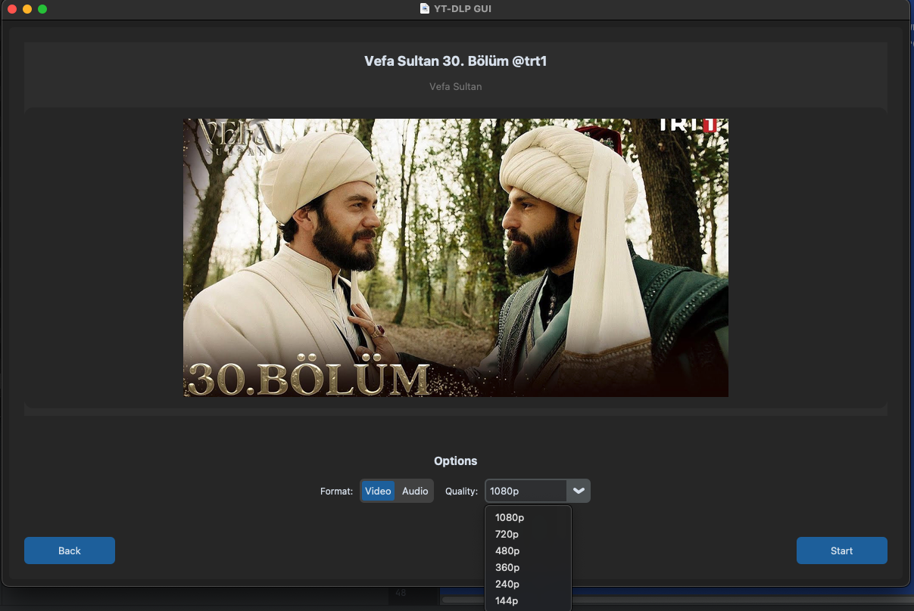

# YT-DLP GUI - YouTube, TikTok and hundreds of sites video and audio downloader

[](https://github.com/devsolux/yt-dlp-gui/releases/latest)
[](https://github.com/devsolux/yt-dlp-gui/releases/latest)
[](https://github.com/devsolux/yt-dlp-gui/releases/latest)



Download the latest builds for your platform from the releases page:

- Latest releases: https://github.com/devsolux/yt-dlp-gui/releases/latest

## Short description

- A user-friendly GUI frontend for yt-dlp that lets you download video and audio from YouTube, TikTok
  and [hundreds of other websites](https://github.com/yt-dlp/yt-dlp/blob/master/supportedsites.md).

## Quick usage

- Click the badge for your OS above to go straight to the latest release and download the appropriate installer or
  archive.
- See the release notes for platform-specific instructions and checksums when provided.

## Resources

- Releases: https://github.com/devsolux/yt-dlp-gui/releases/latest
- Repository: https://github.com/devsolux/yt-dlp-gui
- Supported sites (yt-dlp): https://github.com/yt-dlp/yt-dlp/blob/master/supportedsites.md
- Issues & feature requests: open an issue on the repository

## Tech Stack

- **Python 3.12+** - Core language
- **CustomTkinter** - Modern GUI framework
- **yt-dlp** - Video downloading engine
- **Pillow** - Image processing
- **PyInstaller** - Executable builds

## Installation

### From source

```bash
git clone https://github.com/devsolux/yt-dlp-gui.git
cd yt-dlp-gui

pip install --upgrade pip
pip install --no-cache-dir -r requirements.txt
pip install -e .

python main.py
```

### Build executable

```bash
pip install pyinstaller

rm -rf build/ dist/
python build.py
```

## Usage

1. Launch the application
2. Paste video URL in the input field
3. Wait for video preview to load
4. Select desired quality and format
5. Click "Start" to begin download

## Screenshot

The primary UI screenshot is included in the repository at `assets/main.png`. Replace this file with an updated
screenshot if you want to show a different view.

## License

This project is licensed under the terms described in the [LICENSE](LICENSE) file.